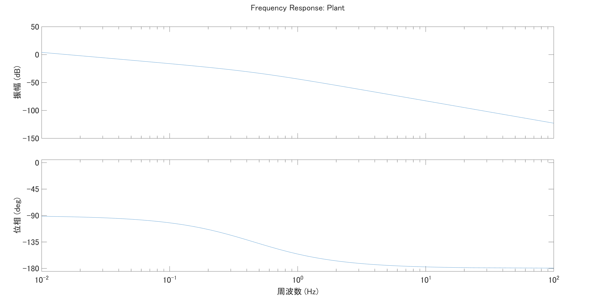

# プラント特性のスケーリング

前回、1軸のテーブルをモデル化して周波数伝達関数の導出まで行いました。

まずはおさらいから。


- m：可動部質量 [kg]
- c：リニアガイドの粘性摩擦係数
- f：サーボ推力, 入力
- x：テーブル位置, 出力

上記のような水平方向に動く1軸のテーブルをサーボ制御するという設定でモデル化しました。

十分な剛性を持つものとしてばね要素は図中から省いてあります。

## 伝達関数とBode線図

```math
G(s) = \frac{1}{ms^2 + cs} = \frac{1}{s}\cdot\frac{1}{(ms + c)}
```



伝達関数は入力に対する出力の比を表すものなので、周波数$f$,振幅$a$の入力を与えたときの振幅と位相の遅れを計算から得ることができます。

これを様々な周波数に対してプロットしたものがBode線図になるので、例えば上の図で10Hz近辺のゲインは-60dBで位相は-180°なので、振幅は1/1000になり位相は-180°遅れる、と単純に読み取ることができます。

## 物理的な意味とスケーリング


（完全な余談なんですがdraw.ioのフォントってなんでこう中国語フォントっぽいんですかね？）

制御対象をモデル化し伝達関数で表現した所で、ブロック線図を確認するとこのようになります。

運動方程式から伝達関数を導出したので、入力は外力（=推力）であり出力は位置です。

先程の話に戻ると、周波数$f$で振幅$a$の力を加えると周波数$f$で振幅$a'$でこのテーブルは振動するということになります。

それではこれにコントローラーを接続してサーボを張ろう…とはいかない現実的な問題があります。

サーボのコントローラーは力を出力してくれません。力を出力するのはモーターです。

そこで、ブロック線図にモーターを追加します。

### モーターをシステムに導入


モーターを動かすのは電流なので、入力は電流指令になりました。

「◯◯hzで力を加えろ」と言われるよりはいくばくか現実的になりました。

少なくとも電流であれば周波数と振幅を決めて出力する仕組みは作りやすいでしょう。

ここで、モーターという要素もまた伝達関数を持ちます。電流指令を入力とし、推力を出力とする要素になります。

仮にこのブロック線図全体を**電流指令を入力**に、**位置を出力**とするシステムを考えた場合の伝達関数は、$G(s)$と$G_{motor}(s)$の直列接続になります。

だいたい推力定数[N/A]としてゲイン要素みたいに扱う場合が多いですが…

周波数によって推力が変わるなど周波数特性が与えられている場合、もしくは測定によって求めた場合、それぞれの伝達関数を掛け算することで電流入力→位置出力の伝達関数を計算することができます。

### アンプ、エンコーダーの導入

ここからいろいろ要素を追加していきます。

<!-- アンプとエンコーダーは離散化の導入 -->
<!-- 離散化誤差や遅れの影響をシミュレーションする -->
