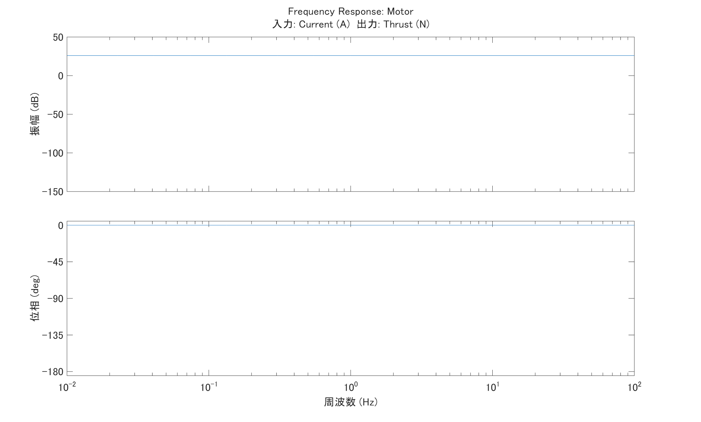
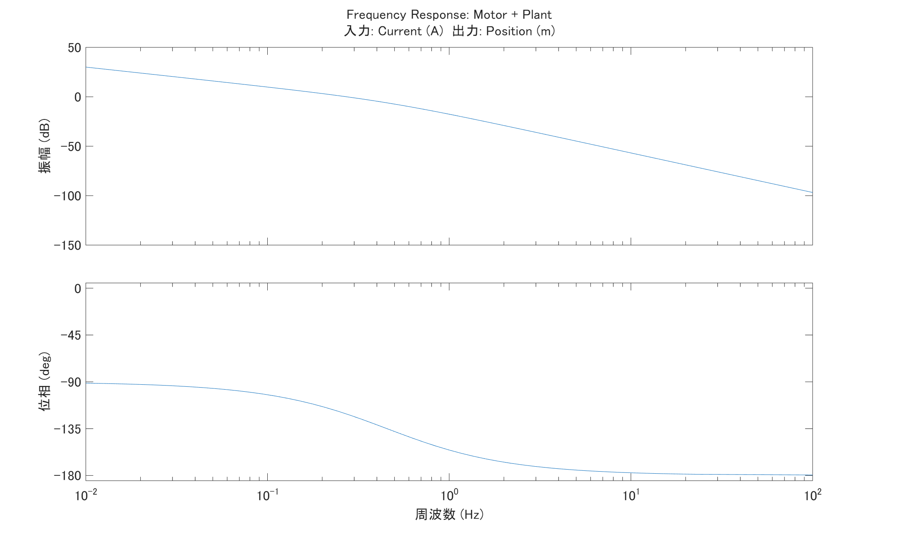
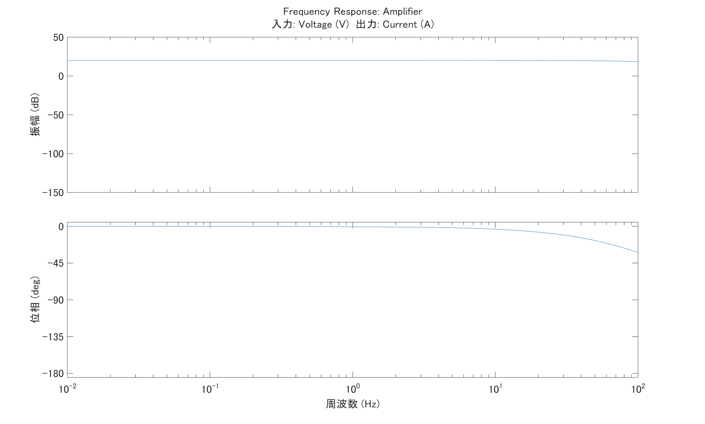
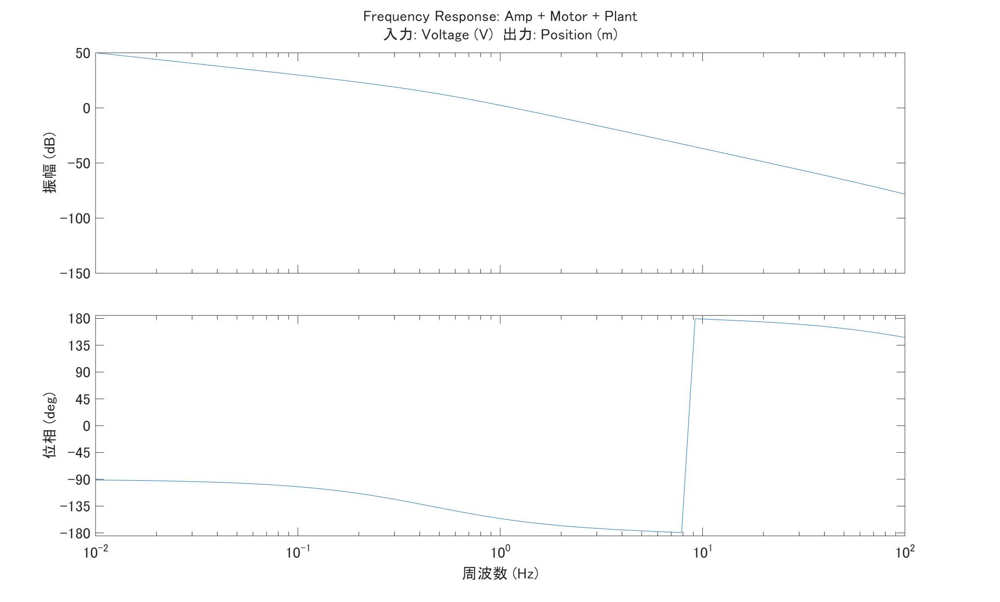

# プラント特性のスケーリング

前回、1軸のテーブルをモデル化して周波数伝達関数の導出まで行いました。

まずはおさらいから。


- m：可動部質量 [kg]
- c：リニアガイドの粘性摩擦係数
- f：サーボ推力, 入力
- x：テーブル位置, 出力

上記のような水平方向に動く1軸のテーブルをサーボ制御するという設定でモデル化しました。

十分な剛性を持つものとしてばね要素は図中から省いてあります。

## 伝達関数とBode線図

```math
G(s) = \frac{1}{ms^2 + cs} = \frac{1}{s}\cdot\frac{1}{(ms + c)}
```


伝達関数は入力に対する出力の比を表すものなので、周波数$f$,振幅$a$の入力を与えたときの振幅と位相の遅れを計算から得ることができます。

これを様々な周波数に対してプロットしたものがBode線図になるので、例えば上の図で10Hz近辺のゲインは-60dBで位相は-180°なので、振幅は1/1000になり位相は-180°遅れる、と単純に読み取ることができます。

## 物理的な意味とスケーリング


（完全な余談なんですがdraw.ioのフォントってなんでこう中国語フォントっぽいんですかね？）

制御対象をモデル化し伝達関数で表現した所で、ブロック線図を確認するとこのようになります。

運動方程式から伝達関数を導出したので、入力は外力（=推力）であり出力は位置です。

先程の話に戻ると、周波数$f$で振幅$a$の力を加えると周波数$f$で振幅$a'$でこのテーブルは振動するということになります。

それではこれにコントローラーを接続してサーボを張ろう…とはいかない現実的な問題があります。

サーボのコントローラーは力を出力してくれません。力を出力するのはモーターです。

そこで、ブロック線図にモーターを追加します。

### モーターをシステムに導入


モーターを動かすのは電流なので、入力は電流指令になりました。

「◯◯hzの振動で力を加えろ」と言われるよりはいくばくか現実的になりました。

少なくとも電流であれば周波数と振幅を決めて出力する仕組みは作りやすいでしょう。

ここで、モーターという要素もまた伝達関数を持ちます。電流指令を入力とし、推力を出力とする要素になります。

仮にこのブロック線図全体を**電流指令を入力**に、**位置を出力**とするシステムを考えた場合の伝達関数は、$G(s)$と$G_{motor}(s)$の直列接続になります。

だいたい推力定数[N/A]としてゲイン要素みたいに扱う場合が多いですが…

周波数によって推力が変わるなど周波数特性が与えられている場合、もしくは測定によって求めた場合、それぞれの伝達関数を掛け算することで電流入力→位置出力の伝達関数を計算することができます。

ここではシンプルに推力定数$K_{motor}$[N/A]をもつものとしてモデル化します。

**モーター単体の周波数特性**


**モーター+プラントの周波数特性**


### アンプ（一時遅れ系）の導入


モーターは電流信号で動きますが、電流そのものの特性ゆえ若干扱いにくいのでより扱いやすい電圧信号との間にアンプが入ります。

ここで扱うアンプはシンプルな電流アンプで、モダンな機能は持たない「電圧信号から対応する電流信号を生成するだけ」のアンプとします。

アンプは時定数$\tau$が存在する連続系としてモデル化します。

**アンプ単体の周波数特性**


**アンプ+モーター+プラントの周波数特性**


アンプは一時遅れ系で位相遅れを生じる（$\tau=1ms$, 100Hzで約-32°）ことから、システム全体の周波数特性では位相が-180°を下回り+180°側にラップしています。

## まとめ

ここまでで、アンプの入力に電圧信号を加えるとそれに応じてこのメカはどのように動くか、まで見積もることができました。


元々の1軸テーブルは運動方程式からスタートして、加えた力に対して位置がどのように変化するかというのを伝達関数の形式で表現していました。

これにモーターとアンプを繋いだことで、実機としてはアンプに電圧を加えるとテーブルが動くシステムになり、それぞれの伝達関数をかけ合わせることでシステム全体の伝達関数を求めたことから、入力が力から電圧に変わってもテーブルの動きを見積もることができるようになりました。

今日はここまで。

<!-- 
// エンコーダーはカウンタやZOH等コントローラーの都合が入るのでそっちにまとめる
### エンコーダーの導入


最後の要素としてエンコーダーを導入します。

パルス出力のリニアエンコーダーで、可動部にスケールを貼り付け、ベース側にリードヘッドを取り付けるものとします。

エンコーダーはスケールの動きをリードヘッドで観測しパルスを出力する連続系でモデル化します。

#### 量子化誤差

ややこしい話ですが、上記のブロック線図でパルス値が$X(s)$ではなく$X'(s)$として表現されているのがこの量子化誤差です。

今回はリニアエンコーダーなので分解能は1パルスあたりの距離 $m/pulse$ になります。

1パルスでこの分解能が表す距離の移動を表現するので、この距離以下の移動は表現できません。これが量子化誤差です。

例えば、分解能$d$が $d = 1 \mu m/pulse$の場合、$X(s) = 1.0 \mu m$が仮に$10000$と表現された場合、$X(s) = 1.1 \mu m$を表すパルス数も$10000$になります。

これは誤差 $e = 0.1 \mu m$に対して、分解能$d$が $d > e$であるため、誤差を表現するのに十分な精度を持たないためです。

この誤差はどうやっても埋めることはできないので、**必要とする精度に対して誤差が十分無視できる**大きさになるように設定します。

教科書的にこの数値が絶対！というものはなく、とにかく高精度なものを！というのはスペック過剰になることから、設計や目的に応じて設定する必要がある項目になります。

目安としては、要求される精度の1/10以下で設定することが多い印象です。 -->
